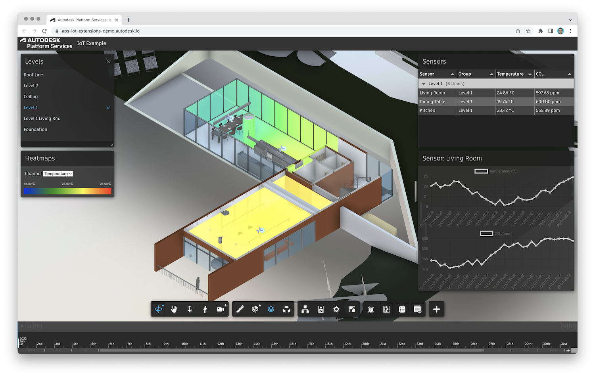

# forge-iot-extensions-demo

Example [Autodesk Forge](https://forge.autodesk.com) application using
[Forge IoT Extensions](https://github.com/petrbroz/forge-iot-extensions) (a set of wrappers around the official
[Data Visualization Extensions](https://forge.autodesk.com/en/docs/dataviz/v1/developers_guide/introduction))
to display historical IoT data in a BIM model.

Live demo: https://forge-iot-extensions-demo.autodesk.io

## Running locally

- Clone this repository
- Install dependencies: `yarn install`
- Setup environment variables:
    - `FORGE_CLIENT_ID` - client ID of your Forge application
    - `FORGE_CLIENT_SECRET` - client secret of your Forge application
- In [public/index.js](./public/index.js), modify `FORGE_MODEL_URN` and `FORGE_MODEL_VIEW`
with your own model URN and view GUID
- In [services/db.json](./services/db.json), modify the mocked up sensors,
for example, changing their `location` (XYZ position in the model's coordinate system)
or `objectId` (the dbID of the room the sensor should be associated with)

> Note: the locations and object IDs in the mocked up data is setup for the rac_basic_sample_project.rvt sample design.

- In [services/iot.mocked.js](./services/iot.mocked.js), adjust the resolution and ranges
of the randomly generated sensor data
- Run the app: `yarn start`
- Go to http://localhost:3000
